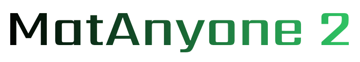
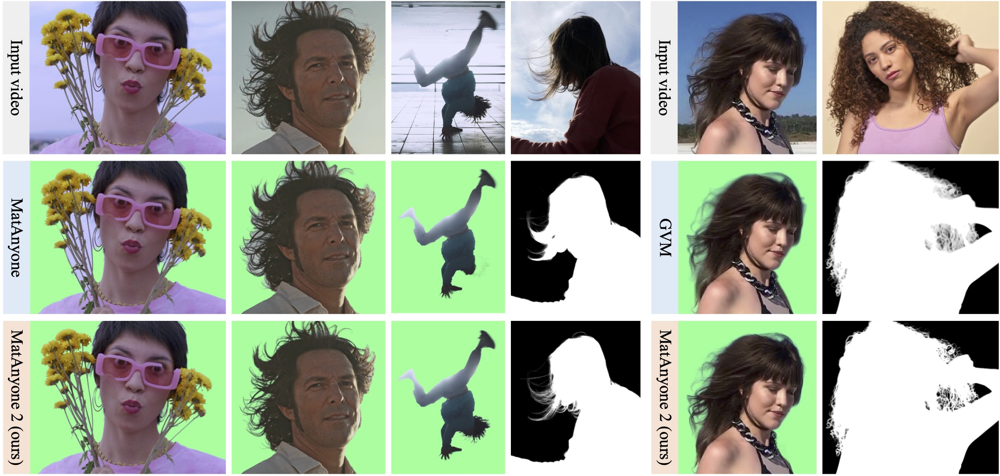
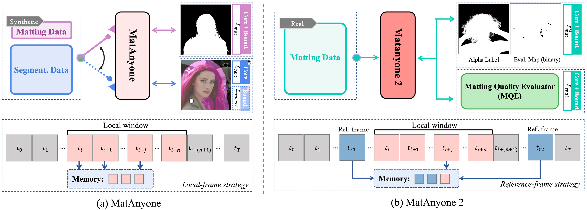
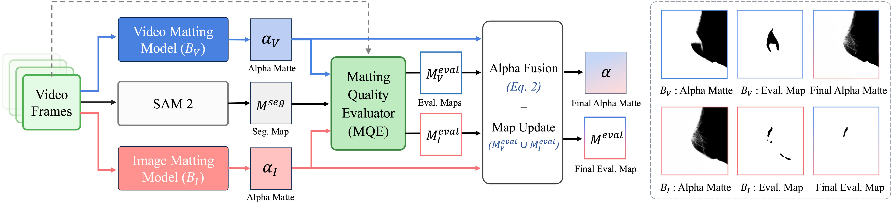

<div align="center">
<div style="text-align: center;">
    
    <h2>Scaling Video Matting via a Learned Quality Evaluator</h2>
</div>

<div>
    <a href='https://pq-yang.github.io/' target='_blank'>Peiqing Yang</a><sup>1</sup>&emsp;
    <a href='https://shangchenzhou.com/' target='_blank'>Shangchen Zhou</a><sup>1†</sup>&emsp;
    <a href="https://www.linkedin.com/in/kai-hao-794321382/" target='_blank'>Kai Hao</a><sup>1</sup>&emsp;
    <a href="https://scholar.google.com.sg/citations?user=fMXnSGMAAAAJ&hl=en/" target='_blank'>Qingyi Tao</a><sup>2</sup>&emsp;
</div>
<div>
    <sup>1</sup>S-Lab, Nanyang Technological University&emsp; 
    <sup>2</sup>SenseTime Research, Singapore&emsp; 
    <br>
    <sup>†</sup>Project lead
</div>


<div>
    <h4 align="center">
        <a href="https://pq-yang.github.io/projects/MatAnyone2/" target='_blank'>
        
        </a>
        <a href="https://arxiv.org/abs/2512.11782" target='_blank'>
        
        </a>
        <a href="https://www.youtube.com/watch?v=tyi8CNyjOhc&lc=Ugw1OS7z5QbW29RZCFZ4AaABAg" target='_blank'>
        
        </a>
        </a>
        
    </h4>
</div>

<strong>MatAnyone 2 is a practical human video matting framework that preserves fine details by avoiding segmentation-like boundaries, while also shows enhanced robustness under challenging real-world conditions.</strong>

<div style="width: 100%; text-align: center; margin:auto;">
    
</div>

:movie_camera: For more visual results, go checkout our <a href="https://pq-yang.github.io/projects/MatAnyone2/" target="_blank">project page</a>

---
</div>


## 📮 Update
- [2025.12] This repo is created.

## 🔎 Overview


## 🛠️ Data Pipeline



## 📑 Citation

   If you find our repo useful for your research, please consider citing our paper:

   ```bibtex
  @InProceedings{yang2025matanyone2,
      title     = {{MatAnyone 2}: Scaling Video Matting via a Learned Quality Evaluator},
      author    = {Yang, Peiqing and Zhou, Shangchen and Hao, Kai and Tao, Qingyi},
      booktitle = {arXiv preprint arXiv:2512.11782},
      year      = {2025}
}
   ```

## 📧 Contact

If you have any questions, please feel free to reach us at `peiqingyang99@outlook.com`. 
